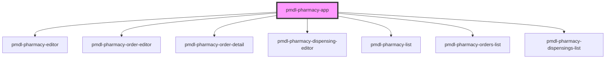

# pmdl-pharmacy-app

<!-- Auto Generated Below -->

## Properties

| Property               | Attribute     | Description | Type     | Default           |
| ---------------------- | ------------- | ----------- | -------- | ----------------- |
| `apiBase` _(required)_ | `api-base`    |             | `string` | `undefined`       |
| `basePath`             | `base-path`   |             | `string` | `''`              |
| `pharmacyId`           | `pharmacy-id` |             | `string` | `'pmdl-pharmacy'` |

## Dependencies

### Depends on

- [pmdl-pharmacy-editor](../pmdl-pharmacy-editor)
- [pmdl-pharmacy-order-editor](../pmdl-pharmacy-order-editor)
- [pmdl-pharmacy-order-detail](../pmdl-pharmacy-order-detail)
- [pmdl-pharmacy-dispensing-editor](../pmdl-pharmacy-dispensing-editor)
- [pmdl-pharmacy-list](../pmdl-pharmacy-list)
- [pmdl-pharmacy-orders-list](../pmdl-pharmacy-orders-list)
- [pmdl-pharmacy-dispensings-list](../pmdl-pharmacy-dispensings-list)

### Graph

----------------------------------------------

*Built with [StencilJS](https://stenciljs.com/)*
