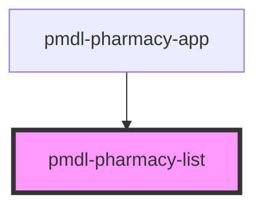

# pmdl-pharmacy-list

<!-- Auto Generated Below -->

## Properties

| Property     | Attribute     | Description | Type     | Default     |
| ------------ | ------------- | ----------- | -------- | ----------- |
| `apiBase`    | `api-base`    |             | `string` | `undefined` |
| `pharmacyId` | `pharmacy-id` |             | `string` | `undefined` |

## Events

| Event           | Description | Type                  |
| --------------- | ----------- | --------------------- |
| `entry-clicked` |             | `CustomEvent<string>` |

## Dependencies

### Used by

 - [pmdl-pharmacy-app](../pmdl-pharmacy-app)

### Graph

----------------------------------------------

*Built with [StencilJS](https://stenciljs.com/)*
